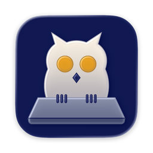

<p align="center">
  
</p>

<h1 align="center">UlulaWake</h1>

<p align="center"><strong>Keep a Mac running with the lid closed, then restore normal sleep safely.</strong></p>

<p align="center">
  <a href="#requirements-and-permissions"></a>
  <a href="https://github.com/yingkaisun-kai/ululawake/releases/latest"></a>
  <a href="LICENSE"></a>
  <a href="https://github.com/yingkaisun-kai/ululawake/releases"></a>
  <a href="https://github.com/yingkaisun-kai/ululawake/actions/workflows/ci.yml"></a>
</p>

<p align="center"><a href="README.md">简体中文</a> · <a href="README.en.md">English</a></p>

[Download](https://github.com/yingkaisun-kai/ululawake/releases/latest) · [Safety guide](docs/SAFETY.md) · [Changelog](CHANGELOG.md)

## Why UlulaWake

UlulaWake is a macOS menu bar utility for downloads, builds, training runs, and other temporary tasks that need to continue after the lid closes. It combines keep-awake controls with timed, low-battery, lid-open, and quit-time recovery paths.

## Highlights

- **Three keep-awake modes:** Indefinite, countdown, or until a chosen time.
- **Multiple automatic recovery paths:** Restore sleep when time expires, battery becomes low, the lid reopens, the user stops the session, or the app quits normally.
- **State safety checks:** Detect possible leftover state after an abnormal exit and report failed recovery instead of showing a false safe state.
- **Optional lid-close lock:** Lock the current session with Accessibility permission and optionally notify when normal sleep returns.
- **Native menu bar experience:** No persistent main window.

## Download and quick start

Download the DMG from the [latest stable release](https://github.com/yingkaisun-kai/ululawake/releases/latest), open it, and drag `UlulaWake.app` into Applications. The installer is Developer ID signed and notarized by Apple.

1. Open the owl menu bar icon and choose **Authorize** to grant the administrator authorization used for sleep control.
2. Choose a mode, duration or end time, low-battery threshold, and lid-open recovery behavior.
3. Enable keep-awake, then stop it manually or let an automatic recovery condition end it.
4. To lock the session when the lid closes, enable the optional Accessibility permission yourself in System Settings.

## Requirements and permissions

- macOS 14 or later
- Apple silicon or Intel Mac
- One administrator authorization for changing system sleep state
- Optional Accessibility permission for locking the current session

Without Accessibility permission, the app falls back to starting the screen saver. **Starting the screen saver is not the same as locking the session.** Lid-closed behavior varies by hardware and system configuration, so verify the full flow on your Mac before relying on it.

## Safety, recovery, and uninstall

Keeping a Mac awake increases power use and heat. Keep it ventilated and never run it in a bag or other enclosed space. Before quitting normally, UlulaWake verifies that normal sleep has been restored and blocks quitting if recovery fails.

If the app cannot be reopened, run:

```sh
sudo pmset -a disablesleep 0
```

Before uninstalling, stop keep-awake, revoke administrator authorization from the menu, quit, and move the app to Trash. Disable Accessibility or login-at-launch settings in System Settings if previously enabled. See the [safety guide](docs/SAFETY.md).

## Updates

Download stable updates manually from [GitHub Releases](https://github.com/yingkaisun-kai/ululawake/releases/latest). UlulaWake currently has no in-app updater.

## Data, network, and privacy

UlulaWake requires no account and uses no cloud service or telemetry. Settings and operational state remain on the Mac.

Report problems through [Issues](https://github.com/yingkaisun-kai/ululawake/issues) with the app version, macOS version, chip type, and reproduction steps. Do not attach passwords or private data.

## Build from source

Xcode 26 or later, including Icon Composer support, and XcodeGen are required:

```sh
brew install xcodegen
./build.sh
./scripts/build-release.sh
```

Download the Developer ID signed and notarized build from the [latest release](https://github.com/yingkaisun-kai/ululawake/releases/latest).

## License

[Apache License 2.0](LICENSE). Copyright 2026 Yingkai Sun.
